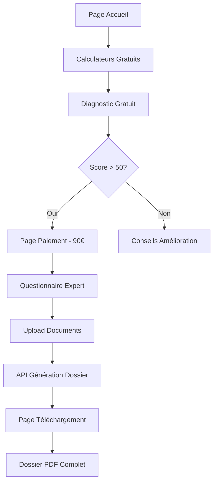

# 📚 Documentation Complète JustiJob
**Version 2.0 - Dernière mise à jour : 11/08/2025**

## 🎯 Vue d'ensemble du projet

JustiJob est une plateforme web qui aide les salariés à constituer leur dossier prud'hommes de manière autonome, avec un modèle économique freemium.

### Modèle économique
- **Gratuit** : Calculateurs de droits + Diagnostic avec scoring
- **Payant** : Dossier prud'hommes complet (90€ public / 45€ syndicats)

### Stack technique
- **Frontend** : Next.js 14 (App Router)
- **Styling** : Tailwind CSS
- **Paiement** : Stripe (à implémenter)
- **Base de données** : PostgreSQL + Prisma (à implémenter)
- **IA** : OpenAI/Claude API (actuellement simulée)

---

## 📁 Structure complète des fichiers

```
justijob-nextjs-version-1/
│
├── 📁 src/
│   ├── 📁 app/
│   │   ├── 📄 page.js                     ✅ Page accueil
│   │   ├── 📄 layout.tsx                  ✅ Layout principal
│   │   ├── 📄 globals.css                 ✅ Styles Tailwind
│   │   │
│   │   ├── 📁 diagnostic/
│   │   │   └── 📄 page.js                 ✅ Diagnostic gratuit avec scoring IA
│   │   │
│   │   ├── 📁 urgence/
│   │   │   └── 📄 page.js                 ✅ Guide prud'hommes gratuit
│   │   │
│   │   ├── 📁 questionnaire/
│   │   │   └── 📄 page.js                 ✅ Questionnaire expert post-paiement
│   │   │
│   │   ├── 📁 telecharger-dossier/
│   │   │   └── 📄 page.js                 ✅ Page téléchargement dossier final
│   │   │
│   │   ├── 📁 paiement/
│   │   │   ├── 📄 page.js                 ✅ Page paiement Stripe
│   │   │   ├── 📁 succes/
│   │   │   │   └── 📄 page.js             ✅ Confirmation paiement
│   │   │   └── 📁 annule/
│   │   │       └── 📄 page.js             ✅ Gestion annulation
│   │   │
│   │   ├── 📁 calculateurs/
│   │   │   ├── 📄 page.js                 ✅ Index des calculateurs
│   │   │   ├── 📁 heures-sup/
│   │   │   │   └── 📄 page.js             ✅ Calculateur heures sup
│   │   │   ├── 📁 licenciement/           
│   │   │   │   └── 📄 page.js             ✅ Calculateur indemnités
│   │   │   ├── 📁 conges-payes/           
│   │   │   │   └── 📄 page.js             ✅ Calculateur congés
│   │   │   └── 📁 prime-anciennete/       
│   │   │       └── 📄 page.js             ✅ Calculateur prime
│   │   │
│   │   ├── 📁 api/
│   │   │   ├── 📁 create-checkout-session/
│   │   │   │   └── 📄 route.js            ✅ API Stripe checkout
│   │   │   ├── 📁 verify-payment/
│   │   │   │   └── 📄 route.js            ✅ Vérification paiement
│   │   │   ├── 📁 analyze-documents/      
│   │   │   │   └── 📄 route.js            ✅ API Analyse IA (simulée)
│   │   │   └── 📁 generate-dossier/       
│   │   │       └── 📄 route.js            ✅ Génération dossier PDF
│   │   │
│   │   ├── 📁 compte/                     🔴 Espace membre (à créer)
│   │   ├── 📁 syndicats/                  🔴 Portail syndical (à créer)
│   │   ├── 📁 contact/                    🔴 Page contact (à créer)
│   │   └── 📁 cgv/                        🔴 CGV (à créer)
│   │
│   ├── 📁 components/
│   │   ├── 📄 DiagnosticForm.js           ✅ Formulaire diagnostic
│   │   ├── 📄 HeuresSupCalculator.js      ✅ Composant calculateur
│   │   ├── 📄 DocumentUpload.js           ✅ Upload sécurisé
│   │   ├── 📄 QuestionnaireGenerator.js   ✅ Générateur questions
│   │   └── 📄 ContractAnalyzer.js         ⏳ Analyseur contrat
│   │
│   └── 📁 lib/
│       ├── 📁 stripe/
│       │   └── 📄 client.js               ✅ Config Stripe
│       ├── 📁 email/
│       │   └── 📄 sendDossier.js          ✅ Service email
│       └── 📁 database/                   
│           └── 📄 prisma.js               🔴 ORM (à configurer)
│
├── 📄 .env.local                          ⏳ Variables environnement
├── 📄 package.json                        ✅ Dépendances
└── 📄 README.md                           ✅ Documentation
```

---

## 🔄 Flux utilisateur complet



---

## 🛠️ Fonctionnalités par module

### 1. CALCULATEURS (/calculateurs/*)
**Objectif** : Outils gratuits pour attirer les utilisateurs

#### Licenciement (/calculateurs/licenciement)
- Calcul indemnité légale vs conventionnelle
- Comparaison 6 conventions collectives
- Majoration licenciement abusif
- Export PDF résultats

#### Congés Payés (/calculateurs/conges-payes)
- Méthode maintien salaire vs 1/10ème
- Calcul fractionnement
- Projection droits futurs
- 2 onglets : Calcul + Vérification

#### Prime Ancienneté (/calculateurs/prime-anciennete)
- 6 conventions (Syntec, Métallurgie, etc.)
- Évolution sur 5 ans
- Mode comparaison conventions
- Calcul préjudice si non versée

#### Heures Supplémentaires (/calculateurs/heures-sup)
- Majorations 25% et 50%
- Calcul mensuel/annuel
- Repos compensateur

### 2. DIAGNOSTIC (/diagnostic)
**Objectif** : Qualifier le dossier et convertir en client payant

- Questionnaire 4 étapes
- Calcul score /100
- Si score > 50 : proposition dossier payant
- Si score < 50 : conseils gratuits

### 3. QUESTIONNAIRE EXPERT (/questionnaire)
**Accès** : Après paiement uniquement

#### 6 sections complètes :
1. Informations personnelles
2. Contrat de travail
3. Nature du litige
4. Preuves et témoignages (max 5 témoins)
5. Procédures suivies (max 10 sanctions)
6. Objectifs et attentes

**Fonctionnalités** :
- Sauvegarde automatique (localStorage)
- Validation par section
- Upload documents final
- Attestation sur l'honneur

### 4. API GÉNÉRATION DOSSIER (/api/generate-dossier)
**Génère automatiquement** :
- Requête CPH personnalisée
- Calcul indemnités (licenciement, congés, préavis)
- Calcul dommages-intérêts
- Arguments juridiques + jurisprudence
- Liste des pièces à fournir
- Modèles de lettres (saisine, mise en demeure)
- Guide procédure étape par étape
- Détermination tribunal compétent

### 5. PAGE TÉLÉCHARGEMENT (/telecharger-dossier)
**Contenu** :
- Résumé complet du dossier
- Montants détaillés (indemnités + dommages)
- Documents PDF à télécharger
- Prochaines étapes procédure
- Guide interactif
- Alerte pièces manquantes

---

## 💰 Modèle de tarification

| Offre | Prix | Contenu |
|-------|------|---------|
| **Gratuit** | 0€ | Calculateurs + Diagnostic + Guide |
| **Grand Public** | 90€ | Dossier complet prud'hommes |
| **Paiement 2x** | 2x45€ | Facilité de paiement |
| **Adhérent Syndicat** | 45€ | -50% avec code syndicat |

---

## 🔐 Variables d'environnement (.env.local)

```env
# Stripe
STRIPE_PUBLIC_KEY=pk_test_...
STRIPE_SECRET_KEY=sk_test_...
STRIPE_WEBHOOK_SECRET=whsec_...

# Base de données (à configurer)
DATABASE_URL=postgresql://...

# IA (à configurer)
OPENAI_API_KEY=sk-...
# ou
ANTHROPIC_API_KEY=sk-ant-...

# Email (à configurer)
SENDGRID_API_KEY=SG...
EMAIL_FROM=noreply@justijob.fr

# App
NEXT_PUBLIC_APP_URL=http://localhost:3000
JWT_SECRET=your-secret-key-here
```

---

## 📦 Dépendances principales

```json
{
  "dependencies": {
    "next": "^14.0.0",
    "react": "^18.2.0",
    "react-dom": "^18.2.0",
    "tailwindcss": "^3.3.0",
    "lucide-react": "^0.263.1",
    "stripe": "^14.0.0",
    "@stripe/stripe-js": "^2.0.0"
  },
  "devDependencies": {
    "eslint": "^8.0.0",
    "typescript": "^5.0.0"
  }
}
```

### À installer pour la production :
```bash
# Base de données
npm install @prisma/client prisma

# Auth
npm install next-auth

# PDF
npm install jspdf html2canvas
# ou
npm install @react-pdf/renderer

# Email
npm install @sendgrid/mail
# ou
npm install resend

# IA (choisir un)
npm install openai
# ou
npm install @anthropic-ai/sdk
```

---

## 🚀 Installation et lancement

```bash
# 1. Cloner le projet
git clone [url-repo]

# 2. Installer les dépendances
npm install

# 3. Configurer les variables d'environnement
cp .env.example .env.local
# Éditer .env.local avec vos clés

# 4. Lancer en développement
npm run dev

# 5. Build production
npm run build
npm start
```

---

## 🔄 Roadmap

### ✅ Phase 1 : MVP (FAIT)
- [x] 4 calculateurs gratuits
- [x] Diagnostic avec scoring
- [x] Questionnaire expert
- [x] Génération dossier
- [x] Page téléchargement

### ⏳ Phase 2 : Production (EN COURS)
- [ ] Intégration Stripe réelle
- [ ] Base de données PostgreSQL
- [ ] Authentification utilisateurs
- [ ] Génération PDF réelle
- [ ] Emails automatiques

### 🔴 Phase 3 : Syndicats (À FAIRE)
- [ ] Système codes promo
- [ ] Portail dédié syndicats
- [ ] Dashboard statistiques
- [ ] Commission automatique

### 🎯 Phase 4 : Croissance
- [ ] IA réelle (OpenAI/Claude)
- [ ] App mobile
- [ ] Marketplace avocats
- [ ] Suivi procédures
- [ ] Chat support

---

## 📝 Notes importantes

### Sécurité
- Toutes les données sont traitées en conformité RGPD
- Pas de stockage localStorage pour les données sensibles
- Upload sécurisé des documents
- Chiffrement des données sensibles

### Points d'attention
1. **Arguments juridiques** : Variable renommée en `argumentsJuridiques` (éviter mot réservé JS)
2. **Suspense** : Utilisé dans telecharger-dossier pour useSearchParams
3. **Validation** : Tous les formulaires ont une validation côté client
4. **Responsive** : Toutes les pages sont mobile-first

### Contacts techniques
- Email support : support@justijob.fr
- Documentation API : /api/[endpoint] (GET pour status)

---

## 🤝 Pour les nouveaux développeurs

### Comprendre le flux
1. Commencer par tester les calculateurs
2. Faire un diagnostic pour voir le scoring
3. Comprendre le questionnaire (6 sections)
4. Examiner l'API generate-dossier
5. Voir le résultat sur telecharger-dossier

### Fichiers clés à examiner
- `/app/diagnostic/page.js` : Logique de scoring
- `/app/questionnaire/page.js` : Formulaire complexe
- `/api/generate-dossier/route.js` : Génération du dossier
- `/app/telecharger-dossier/page.js` : Affichage final

### Tests recommandés
1. Calculateur licenciement : 3000€, 8 ans, Syntec
2. Diagnostic : Répondre pour avoir score > 70
3. Questionnaire : Remplir avec données test
4. Vérifier génération dossier dans console

---

## 📞 Support et questions

Pour toute question sur le code :
1. Vérifier cette documentation
2. Consulter les commentaires dans le code
3. Tester en local d'abord
4. Contacter l'équipe tech

**Dernière mise à jour** : 11/08/2025
**Version** : 2.0
**Auteur** : Équipe JustiJob + Claude (Anthropic)